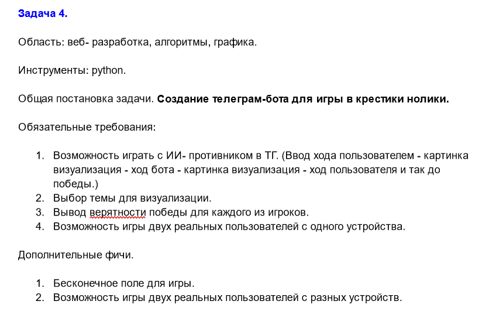

# Телеграмм-бот для игры в крестики-нолики
Университетский проект телеграмм-бота для игры в крестики нолики, с возможностью выбора нескольких режимов игры и визуализации. На данный момент проект завершен, бот работает локально при запуске файла.

## Содержание
- [Технологии](#технологии)
- [Начало работы](#начало-работы)
- [Тестирование](#тестирование)
- [Deploy и CI/CD](#deploy-и-ci/cd)
- [Contributing](#contributing)
- [To do](#to-do)
- [Команда проекта](#команда-проекта)

## Технологии
- Python
  - telebot
  - matplotlib
  - numpy

## Использование
Для использования бота необходим python 3, a также библиотеки numpy, matplotlib, telebot. После их установки запустите файл main_bot.py. После этого можно запустить бота в телеграмме(https://t.me/XsAndOsBot) и тестировать.

[//]: # (![Screenshot_20230806-152041.png]&#40;readme_files/Screenshot_20230806-152041.png&#41;)

[//]: # (![Screenshot_20230806-152119.png]&#40;readme_files/Screenshot_20230806-152119.png&#41;)

[//]: # (![Screenshot_20230806-152836.png]&#40;readme_files/Screenshot_20230806-152836.png&#41;)
## Разработка

### Зачем вы разработали этот проект?
Проект является задачей на вычислительной практике после 1 курса(БГУ, Механико-математический факультет)
 
была реализована дополнительная фича - _Возможность игры двух реальных пользователей с разных стройств_

## Команда проекта
Оставьте пользователям контакты и инструкции, как связаться с командой разработки.

- [Антон Зикрацкий](https://t.me/literature_enjoyer) — основная идея, minmax алгоритм, внедрение его в логику телеграмм бота, игра на двух устройствах
- [Кирилл Конаев](https://t.me/volkodaww) и [Илья Стешкин](https://t.me/steesh) - реализация телеграмм-бота, его логики и тестирование
- [Лера Кочина](https://t.me/lerakoh) - графика и ее внедрение в телеграмм-бот

